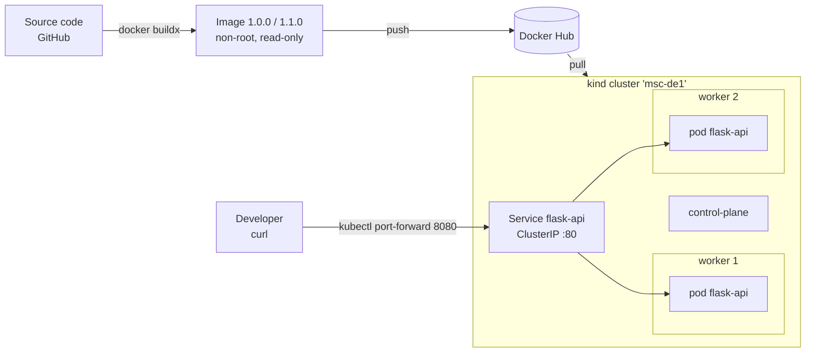

# MSc DE1 – Distributed Systems: Docker & local Kubernetes

Containerization, security hardening, publication and local orchestration of the
[UBC Flask Sample App](https://github.com/ubc/flask-sample-app) (a small Flask REST API with unit tests).

| Item | Value |
|---|---|
| GitHub repository | https://github.com/Messco1/-msc-de1-distributed-systems-docker-k8s |
| Starter application | https://github.com/ubc/flask-sample-app |
| Docker Hub repository | https://hub.docker.com/r/messco/msc-de1-flask-app |
| **Image deployed on Kubernetes (final)** | **`docker.io/messco/msc-de1-flask-app:1.0.0`** |
| Other published tags | `1.1.0` (rolling-update demo), `latest` (= most recent push) |
| Platforms | `linux/amd64`, `linux/arm64` |
| Kubernetes namespace | `msc-de1-project` |

## 1. Objective and architecture

The goal is not to redesign the application but to deliver a clean, secure and reproducible
workflow: **run it locally → containerize → secure → publish → orchestrate**.



Repository layout:

```
app/                  Flask application (original + /health and /version)
tests/                original unit tests + tests of the added routes
Dockerfile            multi-stage build: builder / test / runtime
.dockerignore
gunicorn.conf.py      production WSGI server configuration
compose.yaml          local execution with Docker Compose
kind/kind-config.yaml 1 control-plane + 2 workers
k8s/                  namespace, configmap, deployment, service, network policies
                      (+ secret.template.yaml.txt: template only, never applied)
security/             Trivy scan report + SBOM (SPDX and CycloneDX)
evidence/             command outputs and screenshots used in the report
scripts/              reproducible steps; each script saves its output in evidence/
docs/REPORT.md        technical report source
```

## 2. Prerequisites

| Tool | Tested version | Purpose |
|---|---|---|
| Git | 2.x | clone the repository |
| Python | 3.12 | baseline without Docker |
| Docker Engine / Desktop (with Compose v2 and buildx) | 27+ | build, run, publish |
| kind | ≥ 0.24 (NetworkPolicy support in kindnet) | local cluster |
| kubectl | matching the kind node version | deploy |
| Trivy, Syft (optional: the scripts fall back to their official containers) | – | scan, SBOM |
| A Docker Hub account | – | publication |

```bash
git clone https://github.com/Messco1/-msc-de1-distributed-systems-docker-k8s.git msc-de1-distributed-systems-docker-k8s
cd msc-de1-distributed-systems-docker-k8s
export DOCKERHUB_USER=<your-dockerhub-username>
```

Every step below can be run by hand **or** with the matching script in `scripts/`
(the scripts print each command and save its output to `evidence/command-output/`).

## 3. Run the original application locally (no Docker) — `scripts/00-baseline.sh`

```bash
python3 -m venv .venv
source .venv/bin/activate            # Windows: .venv\Scripts\activate
pip install -r requirements.txt
python -m unittest discover -v tests  # 6 tests: 4 original + 2 added
python run.py                         # http://127.0.0.1:5000 (Flask dev server)

curl http://127.0.0.1:5000/
curl -X POST -H "Content-Type: application/json" -d '{"name":"item1"}' http://127.0.0.1:5000/items
curl http://127.0.0.1:5000/items
curl http://127.0.0.1:5000/items/0
```

> macOS: port 5000 is used by *AirPlay Receiver*; disable it in System Settings if the port is busy.

## 4. Build and run the Docker image — `scripts/01-docker-local.sh`

```bash
# optional: run the unit tests inside a build stage
docker build --target test -t $DOCKERHUB_USER/msc-de1-flask-app:test .

docker build --build-arg APP_VERSION=1.0.0 -t $DOCKERHUB_USER/msc-de1-flask-app:1.0.0 .

docker run -d --name flask-api-test -p 127.0.0.1:8080:8000 \
  --read-only --tmpfs /tmp --cap-drop ALL --security-opt no-new-privileges:true \
  $DOCKERHUB_USER/msc-de1-flask-app:1.0.0

curl http://127.0.0.1:8080/version
docker ps                                    # STATUS shows (healthy)
docker exec flask-api-test id                # uid=10001(app) gid=10001(app)
docker logs flask-api-test
docker stop flask-api-test && docker rm flask-api-test
```

Inside the container the API listens on **port 8000** (Gunicorn); it is published on the host as `8080`.

## 5. Run with Docker Compose

```bash
cp .env.example .env         # optional, git-ignored
docker compose up -d --build # or: docker compose pull && docker compose up -d
docker compose ps            # health: healthy
curl http://127.0.0.1:8080/
docker compose down
```

The Compose service runs as UID 10001 with a read-only root filesystem, a `tmpfs` on `/tmp`,
all capabilities dropped, `no-new-privileges`, CPU/memory/PID limits and a health check.
No privileged mode, no Docker socket, no host networking.

## 6. Docker Hub — `scripts/03-publish.sh <version>`

Public repository: **https://hub.docker.com/r/messco/msc-de1-flask-app**

```bash
docker login -u $DOCKERHUB_USER
docker buildx create --name msc-builder --driver docker-container --use
docker buildx build --platform linux/amd64,linux/arm64 --build-arg APP_VERSION=1.0.0 \
  --provenance=true --sbom=true \
  -t docker.io/$DOCKERHUB_USER/msc-de1-flask-app:1.0.0 \
  -t docker.io/$DOCKERHUB_USER/msc-de1-flask-app:latest --push .

# verification from a clean local state
docker rmi $DOCKERHUB_USER/msc-de1-flask-app:1.0.0 ; docker builder prune -f
docker pull $DOCKERHUB_USER/msc-de1-flask-app:1.0.0
docker run --rm -d -p 127.0.0.1:8080:8000 --name pulled $DOCKERHUB_USER/msc-de1-flask-app:1.0.0
curl http://127.0.0.1:8080/version && docker rm -f pulled
```

| Tag | Content | Used by |
|---|---|---|
| `1.0.0` | first release | **final Kubernetes deployment** (`k8s/deployment.yaml`) |
| `1.1.0` | version bump (`/version` → 1.1.0) | rolling-update demo, then rolled back |
| `latest` | last pushed version | convenience only, never used by Kubernetes |

## 7. Create the kind cluster — `scripts/04-kind-deploy.sh`

```bash
./scripts/set-dockerhub-user.sh $DOCKERHUB_USER   # once: sets the image name in the manifests
kind create cluster --config kind/kind-config.yaml
kubectl get nodes -o wide                          # 1 control-plane + 2 workers
```

## 8. Deploy the Kubernetes manifests

```bash
kubectl apply -f k8s/namespace.yaml
kubectl apply -f k8s/
kubectl -n msc-de1-project rollout status deployment/flask-api
kubectl -n msc-de1-project get deploy,rs,pods,svc,netpol -o wide
```

| Object | Name | Key points |
|---|---|---|
| Namespace | `msc-de1-project` | Pod Security Admission **restricted** (enforce) |
| ConfigMap | `flask-api-config` | `LOG_LEVEL`, `GUNICORN_THREADS` (non-sensitive) |
| Deployment | `flask-api` | 2 replicas, RollingUpdate `maxSurge 1 / maxUnavailable 0`, probes, requests/limits, hardened securityContext, spread over workers |
| Service | `flask-api` | ClusterIP, port 80 → named port `http` (8000) |
| NetworkPolicy | `default-deny-all`, `flask-api-allow-ingress-from-clients`, `api-client-allow-egress` | deny by default; API reachable on 8000 only from pods labelled `role=api-client` |

## 9. Access and test the application

```bash
kubectl -n msc-de1-project port-forward svc/flask-api 8080:80
curl http://127.0.0.1:8080/
curl http://127.0.0.1:8080/version
curl -X POST -H "Content-Type: application/json" -d '{"name":"k8s"}' http://127.0.0.1:8080/items
curl http://127.0.0.1:8080/items/0
```

Distributed-systems demonstrations (`scripts/05-demos.sh`, requires tag `1.1.0` to be published):

```bash
# A. load balancing + network policy (test pods in scripts/netpol-test-pods.yaml)
kubectl apply -f scripts/netpol-test-pods.yaml
kubectl -n msc-de1-project exec client-allowed -- curl -s http://flask-api/version   # repeat: pod name changes
kubectl -n msc-de1-project exec client-denied  -- curl -s -m 5 http://flask-api/health  # times out
# B. self-healing
kubectl -n msc-de1-project delete pod <one-flask-api-pod>
kubectl -n msc-de1-project get pods -w
# C. scaling
kubectl -n msc-de1-project scale deployment/flask-api --replicas=3
kubectl -n msc-de1-project scale deployment/flask-api --replicas=2
# D. rolling update and rollback
kubectl -n msc-de1-project set image deployment/flask-api api=docker.io/$DOCKERHUB_USER/msc-de1-flask-app:1.1.0
kubectl -n msc-de1-project rollout status deployment/flask-api
kubectl -n msc-de1-project rollout history deployment/flask-api
kubectl -n msc-de1-project rollout undo deployment/flask-api
```

## 10. Security scan and SBOM — `scripts/02-security-scan.sh`

```bash
trivy image docker.io/$DOCKERHUB_USER/msc-de1-flask-app:1.0.0 > security/vulnerability-scan.txt
syft docker.io/$DOCKERHUB_USER/msc-de1-flask-app:1.0.0 -o spdx-json > security/sbom.spdx.json
```

## 11. Clean up — `scripts/99-cleanup.sh`

```bash
kind delete cluster --name msc-de1
docker compose down
docker buildx rm msc-builder
```

## 12. Security decisions and known limitations

**Decisions**

- Multi-stage build on `python:3.12-slim-trixie`; the runtime stage contains only the virtualenv,
  `app/` and `gunicorn.conf.py` — no tests, no compiler, **no pip**, no curl.
- Non-root user with a **fixed numeric UID/GID 10001** (`USER 10001:10001`), required for
  Kubernetes `runAsNonRoot` to verify the user. Application files are owned by root → read-only for the process.
- Gunicorn replaces Flask's development server; it runs as PID 1 (exec form) and handles SIGTERM gracefully.
- Read-only root filesystem everywhere (Docker flags, Compose, Kubernetes); the only writable path is
  `/tmp` (tmpfs / memory `emptyDir`, 16 MiB), used by Gunicorn's worker heartbeat.
- All capabilities dropped, `no-new-privileges` / `allowPrivilegeEscalation: false`, seccomp `RuntimeDefault`,
  no host namespaces, no hostPath, service-account token not mounted.
- Resource requests/limits in Kubernetes; CPU, memory and PID limits in Compose.
- Namespace enforces the Pod Security Standard **restricted**: a non-compliant pod is rejected by the API server.
- Dependencies fully pinned; image scanned with Trivy and inventoried with an SBOM (see `security/`).
- No secrets are needed. `k8s/secret.template.yaml.txt` documents how a secret would be created at deploy time without being committed.

**Known limitations**

- **In-memory state.** The starter app stores items in a Python list. Each pod (and each Gunicorn worker
  process) has its own list, so a `POST` handled by one pod is invisible to the others. Gunicorn is
  therefore configured with one worker process and several threads; across replicas the data remains
  inconsistent (shown in the demo). Production fix: move the state to an external store (PostgreSQL / Redis).
- The original tests are order-dependent (`test_get_item_route` relies on `test_add_item_route` running first).
- The NetworkPolicy relies on kindnet's policy support (kind ≥ 0.24). With an older kind, install Calico or Cilium.
- Local access uses `kubectl port-forward`; there is no Ingress and no TLS.
- Base-image OS packages may carry vulnerabilities without an available fix; see the analysis in the report.

## License

The starter application is MIT-licensed (see `LICENSE`, © UBC / Pan Luo).
